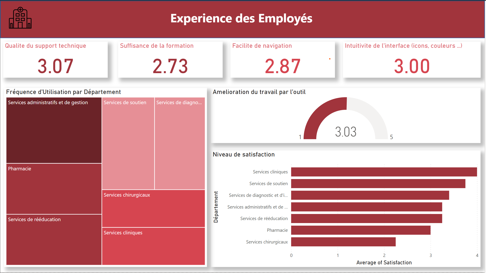

# 📌 Project Overview

This project focuses on analyzing employees' experience while using a Digital Asset Management (DAM) tool to support decision-making processes within an organization.
The goal is to gain insights into how employees interact with the DAM tool, identify challenges, and measure its effectiveness in improving productivity and decision accuracy.

The data for this project was collected via a Google Form survey distributed among employees.

# 🗂️ Dataset Information

Source: Google Form responses

Format: CSV / Excel

Size: Small to medium dataset

Key Columns (example):

- Departement
  
-Frequence d'usage de l'outil

-Etes-vous satisfait par l'outil ?

-Combien de minute en moyenne vous avez optimise lors de depot du contenu ?

-Est-ce que vous trouvez ce que vous voulez rapidement ?

-A quel niveau l'interface est intuitive ?

-Est-ce que cet outil a ameliore votre travail ?

-Est-ce que la formation recu etait suffisante ?

-Est-ce que le support technique est satisfaisant ? 

# 🎯 Objectives

Understand employees' overall experience using the DAM tool.

Identify departments or roles facing usability challenges.

Measure the perceived impact of the DAM tool on decision-making.

Provide actionable insights through an interactive dashboard.

# 📊 Dashboard Features

The dashboard was built using Power BI and includes:

Overall satisfaction levels with the DAM tool.

Frequency of usage across departments and roles.

Correlation between tool usage and decision-making efficiency.

Key pain points and suggestions for improvement.

# 🛠️ Tools & Technologies

Data Collection: Google Forms

Data Cleaning & Transformation: Microsoft Excel / Power Query

Data Visualization: Power BI

Decision Insights: Derived from dashboard analytics
